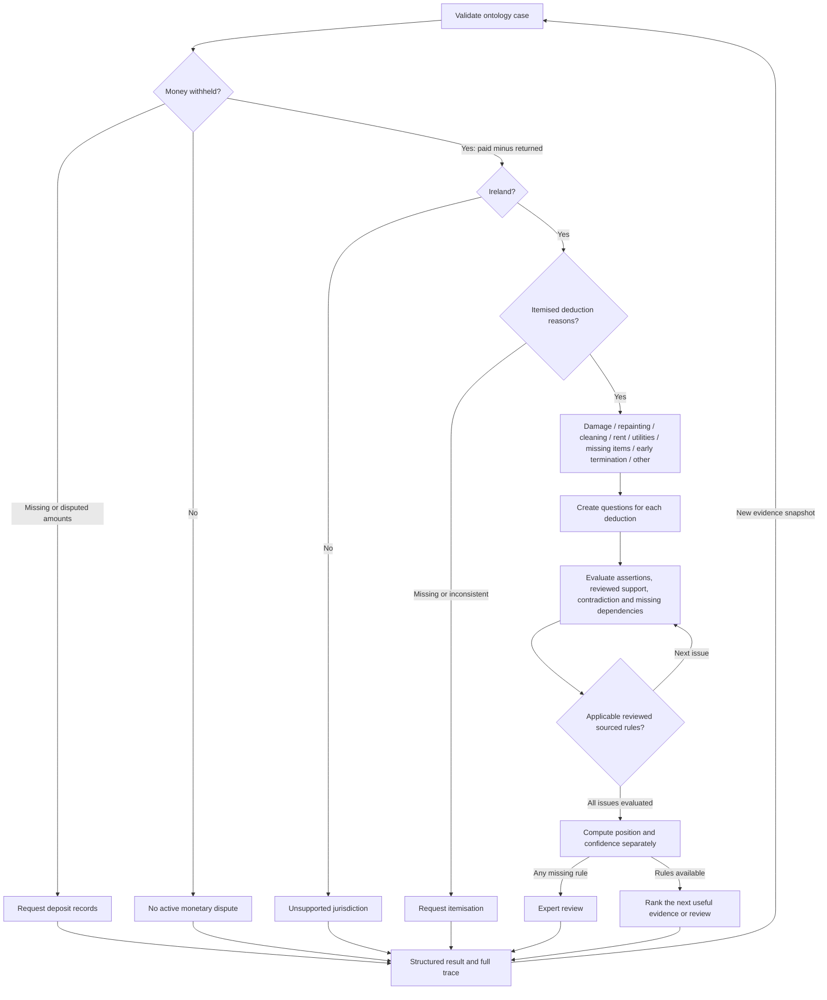

# Deterministic decision graph

The graph in `src/reasoning/graph/` operates on validated ontology objects, without an LLM or agents. It returns an evidence-based triage position from the tenant's perspective, not an RTB determination. The public UI continues using its existing mocks; legacy assessment HTTP routes still return 501 because their transport models have not been adapted to the ontology.

## Run

```sh
npm run graph -- --demo
npm run graph -- path/to/ontology-case.json 2026-10-04
```

The demo executes both snapshots and writes their full inputs, rule snapshots, assessments and decision traces to `DATA_DIR/assessments/<sha256>.json`. These files are local and gitignored. No frontend, API key, network or locally downloaded corpus is needed to run the graph: a reviewed source catalogue is versioned with the code. Custom case input must satisfy `CaseSchema`; the current graph accepts exactly one deposit-retention claim and one monetary deduction per category. Aggregate multiple invoices under the relevant deduction before evaluation.

Programmatic entry points:

```ts
import { evaluateCase, reassessCase } from "../src/reasoning/graph/evaluate";
import { DEFAULT_CATALOGUE } from "../src/reasoning/graph/catalogue";

const options = {
  asOf: "2026-10-04",
  catalogue: DEFAULT_CATALOGUE,
  evidenceAssignments: [],
};
const initial = evaluateCase(ontologyCase, options);
const update = reassessCase(initial, updatedOntologyCase, options);
```

`evaluateCase` and `reassessCase` are pure and do not mutate cases or persist by themselves. Server-only `assessAndStore` and `reassessAndStore` evaluate and persist full runs. Call reassessment with the complete new snapshot on every evidence addition, edit, review or deletion. Persisted runs bind the input, rules and result with a content hash, reuse identical runs, write atomically, and reject corrupted records on load. An old assessment is never edited in place.

## Graph



## Node definitions

Every node is a typed `Node` with `id`, `question`, `requiredInputs`, `evaluationMethod`, `possibleResults`, `nextNodes`, `provenanceRequirements`, and `escalationConditions`. The executable evaluators emit these IDs into the trace. Full definitions, including every field, are in [decision-graph.nodes.json](decision-graph.nodes.json) and `definitions.ts`.

| Node | Question / inputs | Evaluation and possible results | Next nodes |
| --- | --- | --- | --- |
| start | Is the structured case valid? Case, claim, options | Zod and reference validation; valid or input exception | money |
| money | Is money withheld? Paid/returned facts | Integer subtraction; withheld / none / unknown | jurisdiction or finish |
| jurisdiction | Is this Ireland? Jurisdiction string | IE/Ireland aliases; supported / unsupported | reasons or finish |
| reasons | What deductions are stated? Typed monetary facts | Category lookup, total and ambiguity checks; classified / missing / inconsistent | issues or finish |
| issues | What needs determination? Branch templates | Create stable ontology issues per deduction | evidence |
| evidence | What is established or missing? Facts, edges, evidence, assignments | Reviewed links; unresolved / conflicted / landlord_supported / tenant_supported | rules |
| rules | What reviewed sources apply? Topic, jurisdiction, assessment date, trusted catalogue | Exact lookup; available / unavailable | evidence for next issue, then position |
| position | What follows overall? All issues and rule coverage | Precedence below, separate confidence | next |
| next | What would help most? Unresolved issue dependencies | Ranked request / review / none / expert_review | finish |
| finish | What is returned? Full result and trace | Validate structured output | end |

Money provenance retains the input fact IDs and distinguishes asserted from corroborated amounts. Evidence nodes preserve fact/evidence IDs and original source excerpts. Rule nodes require original ingestion source identity, text, offsets and review windows. Missing rule coverage escalates. Material conflict prevents high confidence. The trace includes explanations for every executed gate and issue evaluation, rather than only the final label.

## Deterministic logic

1. Validate the ontology and require one claim. Unknown or duplicated amount propositions are not guessed. Contradicted amounts require clarification before calculating a result.
2. Subtract `deposit_returned` from `deposit_paid` in integer euro cents. For a zero/negative balance, return `no_active_dispute`, zero amount, null position and no action. For asserted amounts, label the calculation `asserted`; it is not an independently verified sum.
3. Require jurisdiction `IE` or `Ireland` (case-insensitive). Otherwise return `unsupported`, null position and a jurisdiction-specific referral.
4. Recognise explicit fact types such as `painting_deduction`, `cleaning_deduction`, `rent_arrears_deduction`, `utilities_deduction`, etc. An unknown `*_deduction` becomes `other`. Missing structured reasons request itemisation; the graph does not guess reasons from free text. Zero, non-monetary, disputed, duplicate-category or unreconciled deductions require corrected itemisation.
5. Instantiate stable issues using `graph:<deduction-fact-id>:<requirement-type>`. Generated Issue records carry the original claim ID. Existing case issues are not overwritten. Each issue result links its fact IDs, reviewed supporting/contradicting/neutral evidence, unreviewed candidates, rule IDs and source excerpts.
6. An assertion alone cannot verify a proposition. A supported boolean needs a corroborated fact and reviewed evidence of a relevant type. A monetary-cost proposition needs corroboration and suitable supplied, reviewed records. An invoice merely claimed to exist, or uploaded without review, leaves cost unresolved. A documented invoice amount does not establish causation, ordinary wear or authenticity.
7. Contradictory evidence or competing facts of the same type produce a conflicted issue. `contradicted` means contested, not automatically false.
8. Retrieve exact issue coverage from the trusted catalogue. Both evidence guidance and deduction guidance/legislation must apply. Unknown, out-of-window, future-effective and unrelated entries cannot satisfy the gate.

Position precedence, from the tenant's perspective:

| Condition | Position |
| --- | --- |
| Any material issue lacks reliable rule coverage | expert_review |
| Any material issue has conflicting evidence | uncertain |
| Every deduction has a reviewed proposition challenging its justification or amount | strong |
| All material issues support the landlord and none remain unresolved | weak |
| Some material issues support the landlord while others remain unresolved | uncertain |
| Otherwise, with rule coverage and unresolved substantiation | worth_pursuing |

These are versioned product triage policies, not rules quoted from the RTB. `strong` can concern challenging part of an amount; it does not promise recovery of the whole deposit. Missing evidence is a reason to seek substantiation, not proof that a deduction is unlawful.

Confidence is separate: missing rules, conflicting material evidence, or no relevant supplied documents yield `low`. Remaining unresolved facts or asserted monetary inputs cap it at `medium`. `high` requires fully resolved issues, corroborated monetary facts and applicable legislative coverage. The bundled catalogue contains guidance only and therefore caps assessed positions at `medium`. This deliberate cap avoids presenting a simplified RTB guidance page as a definitive legal assessment.

## Rules and provenance

The bundled catalogue contains actual ingestion excerpts from:

- [RTB guide to evidence](https://rtb.ie/disputes/guide-to-evidence/), “Deposit retention case”: document `bf798ba9-589d-53b4-9e6a-dd8fa4786537`, original text offsets 2394–2682.
- [RTB security deposits](https://rtb.ie/renting/rights-responsibilities/security-deposits/), “Reasons for keeping the deposit”: document `10e638cb-94c7-597a-89a9-bb2d1bb7b79d`, original text offsets 1956–2605.

`catalogue.json` preserves the full source checksum, URL, original text, document ID, chunk ID, section, and null publication dates/pages where unavailable. Entries were checked for this implementation on 2026-10-04 with an operational review deadline of 2027-04-04. Those dates describe catalogue maintenance, not statutory commencement dates; unknown legal effective dates remain null. Runs before/after the reviewed window fail closed to expert review. The demonstration explicitly uses its fixed 2026-10-04 date for repeatability.

This is a curated local lookup, not semantic search. Catalogue inputs are trusted application configuration and must not be accepted from users or model output as authenticated legal material. Case-supplied `rules` are not automatically trusted. Adding a source requires ingestion, `sourceFromChunk`, verification of the exact passage, reviewed issue/scope mapping and catalogue version review. Whitespace in original text is preserved exactly to keep ingestion offsets valid. Do not assign legislative scope to guidance. Early termination and `other` deliberately lack coverage: the broad RTB overview is insufficient to encode the relevant exceptions and calculations.

To refresh, download the public page normally into `data/raw/`, add `<filename>.meta.json` with its actual source URL/organisation/type, and run `npm run ingest`. Inspect the active manifest and the relevant processed chunk, then replace the catalogue entry using `sourceFromChunk`. Do not synthesize missing source dates or promote a general evidence checklist into an entitlement rule. The original HTML and processed corpus stay local; the reviewed excerpts required by this graph are committed for reproducibility.

## Evidence dependencies

| Issue family | Potential evidence |
| --- | --- |
| Painting required, tenant causation, damage beyond wear | Move-in/out photos, signed inventory, condition report, landlord photos, damage messages |
| Cleaning required / beyond ordinary use | Before/after condition evidence, inventory, photographs and messages |
| Painting/cleaning/repair/replacement cost | Itemised invoice, contractor estimate, payment proof, work description |
| Rent arrears | Rent ledger, receipts/payment records, tenancy agreement |
| Utility responsibility / balance | Tenancy agreement, final utility bills, payment proof |
| Missing items | Signed inventory, condition report, move-out photographs and cost records |
| Early termination | Agreement, notice/service records, rent ledger and payment evidence; expert review required |
| Other | Documents explaining the deduction; expert review required |

Evidence already linked to a fact is matched to its issue dependencies. `evidenceAssignments` additionally maps unreviewed documents to a role and optional deduction fact ID without asserting support. For example, a photo may be assigned `move_in_photos`; an invoice must be associated with the relevant deduction. Invalid evidence IDs/types/deduction references fail validation. A null deduction ID indicates explicitly shared material. The engine never infers a document's role from its filename.

Absent dependencies generate requests; supplied but unresolved material generates targeted reviews. Alternatives are not all mandatory. A resolved issue generates no further checklist. The next useful task is scored by material conflict (+100), invoice for an unresolved cost (+60), reviewing available material (+30), supplied landlord photos (+8) or move-in/out photos (+5), bounded deduction amount (`min(cents / 10000, 20)`), and issue coverage (+10 per covered issue). Ties use deduction ID then role. This is a transparent heuristic, not an LLM ranking or a legal probability.

## Reassessment and worked result

The existing ontology demo is used directly. €1,500 paid minus €500 returned gives **€1,000 withheld**. Painting €700 plus cleaning €300 creates seven issue evaluations. Initial documents remain unreviewed candidates. No supplied invoice supports the painting cost. With applicable guidance and unresolved substantiation, the graph computes **worth_pursuing / medium** and ranks the painting invoice request first.

The new snapshot supplies the €700 painting invoice and landlord photographs. Its existing authored review establishes only the invoice face value and photograph availability. Painting cost now has documentary support, while necessity, tenant causation, ordinary wear and cleaning remain unresolved. The same policy computes **uncertain / medium**. The highest-ranked next task becomes reviewing the landlord photographs. No position is set by the demo code.

Reassessment always reruns the gates, all affected issues and final aggregation. This MVP deliberately reruns all issues as well, avoiding stale caches at its small scale. It reports changed issue IDs and all recomputed node IDs. Additions, edits, deletions, altered fact reviews, rule changes and source expiry all participate. Reverting to the initial evidence snapshot recomputes the initial position. It never reuses an old position or counts an old result as new evidence.

The complete output contains `amount_in_dispute` (integer EUR cents), `position`, `confidence`, `central_issue`, supporting/adverse factors, unresolved facts, missing evidence, next evidence/action, escalation, issue evaluations, full trace and source references. Gate exits use explicit statuses and null positions where no merits assessment is appropriate. Saved runs also retain the exact input and catalogue for audit.

## Tests and boundaries

Tests cover no/negative withheld money, unknown amounts, unsupported jurisdiction, missing reasons, unreconciled deductions, all eight branches, missing/asserted/unreviewed invoices, unrelated evidence, conflicting evidence, unavailable/expired/future/unrelated rules, strong/weak separation, computed reassessment, evidence removal, provenance, node definitions, serialisation, immutability, persistence, duplicate runs and tamper detection.

The graph can triage structured reviewed facts. It does not read photos, authenticate invoices, infer facts from documents, calculate wear depreciation, handle multiple claims, establish tenancy coverage exceptions, send requests or initiate RTB proceedings. Those require subsequent scoped work. There are no agents or OpenAI calls.
